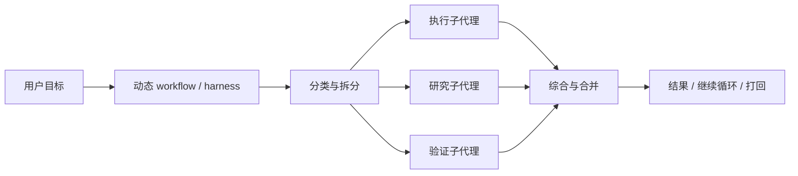

# harness工程
## 定义
`harness工程` 指的不是智能体本身的能力设计，而是为智能体搭建一个可持续运行、可重复接手、可验证进展的工程外壳（harness）。

它关注的问题是：
- 智能体如何跨多个上下文窗口持续工作
- 每一轮结束后如何留下清晰的交接状态
- 新一轮智能体如何快速恢复上下文并继续推进

## 为什么重要
长时运行智能体的难点，往往不是单轮能力不够，而是跨轮次连续性差。

如果没有好的 harness，智能体常见会出现这些问题：
- 一次做太多，最后停在半成品状态
- 下一轮接手时不知道之前做了什么
- 明明只完成了一部分，却错误宣布任务结束
- 反复花时间理解环境，而不是持续推进任务

## 当前理解
- 上下文压缩只能部分解决记忆问题，不能替代工程化交接。
- 真正有效的做法是把状态显式写进环境，而不是只留在模型上下文里。
- 一个好的 harness 会把“进度、目标、运行方式、验证方法”都外化成明确工件。
- 长时运行系统的关键，不是让模型永远记住，而是让它每次都能快速重新进入有效工作状态。
- 当任务进一步变长、变复杂时，harness 不只要解决连续性，还要解决自我评估偏乐观的问题。
- harness 既可以是预先设计的静态外壳，也可以是按任务临时生成的动态工作流（dynamic workflow）。
- 近期更现实的自我改进（self-improvement）路径，可能不是模型直接改写自己权重，而是先让 harness、上下文、workflow、工具和评估系统变成可优化对象。
- 文件系统更准确地说是持久工作区（persistent workspace），不是最终长期知识库。它适合保存轨迹、日志、产物和中间状态；长期知识必须经过治理后才能升格。
- loop 可以看作 agent 外部的 [[wiki/concepts/测试时计算|测试时计算（test-time compute）]]：通过多轮计划、行动、观察和修正，把一次性输出变成可验证过程。

## 我们目前对它的四个关键判断
### 1. 它补充了 harness工程的第二类核心失败源
如果前一阶段的 harness 主要在解决“如何跨轮次保持连续性”，这篇进一步指出，长时任务至少有两类常见失败：
- 上下文越来越长后，模型会漂移、失焦，甚至提前收尾
- 模型会高估自己产出的质量，尤其在设计、产品质量或复杂实现上容易自我感觉良好

这意味着 harness工程不能只处理“记忆与交接”，还必须处理“判断与纠偏”。

### 2. 最关键的工程杠杆是生成与评估分离
这篇最重要的工程洞见之一是：
- 不要让负责产出的智能体同时负责判断自己做得好不好

更稳的做法是：
- 生成者负责推进实现
- 评估者负责根据显式标准、真实交互和环境反馈来验收

它的价值不只是多一个 agent，而是通过角色分离降低系统性的自评偏差。

### 3. 它把“自评不可靠”从经验感受提升为工程原则
很多人知道模型自评会偏乐观，但这篇的推进在于，它把这个问题正式转化成 harness 设计原则：
- 让生成者自评，通常会偏宽松
- 单独调教一个更苛刻的评估者，通常更可行
- 评估标准必须显式化，否则“好不好”只是模糊印象

因此，优秀的 harness 不只要有执行链路，还要有独立的审查链路。

### 4. 它让 harness工程从“连续性系统”升级为“纠偏系统”
较早的 harness 更像是在回答：
- 如何让 agent 不掉线

这一阶段的 harness 更进一步回答：
- 如何让 agent 不自嗨
- 如何在长时间运行里持续纠偏
- 如何让高层目标和阶段性实现之间保持对齐

所以，harness工程不只是交接系统，也是一种持续校正方向和质量的系统。

## 核心组成
### 1. 初始化环境
- 在第一次运行时建立基础工程骨架
- 明确如何启动环境、如何验证系统是否正常
- 准备后续轮次都能复用的运行说明

### 2. 进度记录
- 用进度文件持续记录做了什么、卡在哪里、下一步建议是什么
- 让新一轮智能体不用从零猜测历史
- 进度记录应简洁、结构清晰、便于快速浏览

### 3. 目标清单
- 把任务拆成明确、可验证的特性或子目标
- 每轮只推进一小步，而不是试图一次完成全部
- 目标状态最好结构化表示，减少随意改写

### 4. 干净交接
- 每轮结束时，代码、文件和状态应尽量处于可接手状态
- 最好留下提交记录、说明文本和基本验证结果
- 交接质量比单轮做了多少功能更重要

### 5. 环境验证
- 新一轮开始时先验证系统当前是否健康
- 如果基础功能已经损坏，应优先修复，而不是直接叠加新功能
- 智能体要依赖真实环境反馈，而不是只根据自己的推理判断系统状态

### 6. 生成与评估分离
- 不要让负责产出的智能体同时扮演最终评审
- 生成者（generator）负责实现，评估者（evaluator）负责验收、质检和打回
- 对长时复杂任务而言，这种分离能显著降低“自己觉得自己做得不错”的偏差

### 7. 完成标准前置
- 在开始一个阶段性任务前，先明确什么叫“完成”
- 对高层目标和可验证实现之间的落差，最好先用一份阶段合同来桥接
- 如果没有明确的验收条件，智能体很容易在错误方向上持续推进

### 8. 动态编排
- 对复杂任务，harness 可以临时生成一段工作流脚本，而不是永远复用同一个固定流程
- 这段脚本负责拆分任务、启动子代理、选择模型、隔离 worktree、收集结果和判断停止条件
- 动态编排适合高价值、长链路、结构复杂或需要强验证的任务，不适合普通小任务

### 9. 自修改治理
- 如果 agent 会修改记忆、工具、prompt、workflow 或模型参数，harness 必须记录每次变更
- 变更不能直接进入生产路径，应先经过评估、审计和必要时人工确认
- 好的 harness 应该支持版本化、回滚和演化前后对比，而不是只追求持续推进

### 10. 持久工作区
- 长任务不能把全部历史、日志和子代理输出都塞进上下文窗口
- harness 应把执行轨迹、实验日志、代码 diff、错误 trace、子任务结果写入可检查的外部工作区
- 但这些文件默认只是工作记忆，不是长期知识；需要垃圾回收、压缩、归档、去重和升格机制

### 11. Harness 优化器
- 当 harness 变成代码，prompt、上下文、workflow、工具调用、子代理结构和评估逻辑都可以进入搜索空间
- 优化对象会从 `instruction prompts` 演进到 `structured context`、`workflow`、`harness code`，甚至 `optimizer code`
- 这意味着 loop engineer 的工作不是写一句提示词，而是设计一个可运行、可评估、可改进的执行系统

### 12. Thinking policy
- harness 需要决定什么时候让模型多想，什么时候直接执行，什么时候调用工具验证
- thinking budget 不能无限增长，应根据任务难度、风险和成本动态分配
- 简单任务不需要复杂 loop；超出模型能力的任务也不能靠无限循环解决

## 设计原则
### 1. 把记忆外化
- 不把连续性完全依赖在上下文窗口里
- 把关键信息写入文件、提交记录和结构化清单

### 2. 用增量推进代替一口气完成
- 每次只处理一个高优先级问题
- 小步推进更容易验证，也更容易交接

### 3. 优先可接手，而不是看起来很忙
- 一轮结束时应留下可继续工作的状态
- 不要为了追求表面进度制造更大混乱

### 4. 让环境成为真相来源
- 以 git 历史、运行脚本、测试结果、进度文件为外部事实基础
- 不依赖模型对先前会话的模糊回忆

### 5. 分离生成与判断
- 生成能力强，不等于评估能力可靠
- 让独立评估者根据明确标准审查结果，通常比让生成者自评更有效
- 任务越主观、越复杂，这种分离越重要

### 6. 用阶段合同约束推进方向
- 每个阶段开始前，先约定目标、边界和验证方法
- 这相当于给智能体一个局部、可测试的 done 定义
- 它能减少高层需求过于模糊导致的跑偏

### 7. 把文件当工作台，而不是垃圾桶
- 允许 agent 落文件，是为了可恢复、可审计、可比较和可复现
- 但每类文件都应有生命周期：临时草稿、运行日志、交付产物、候选记忆、正式知识不能混在一起
- 没有过期、压缩、去重和升格机制的“长期记忆”，最后会变成上下文污染源

### 8. 让自我改进受限发生
- agent 可以提出 harness 改动候选，但不能自由修改权限、安全、审计和评估层
- 自修改应优先针对反复出现、可定位、可窄改动修复的失败模式
- 合并前必须经过 held-in 和 held-out 回归验证，避免修好一个点但破坏未知能力

## 进阶结构
当任务规模继续上升时，harness 往往会从“单代理 + 外部工件”演化为“角色分离 + 多轮协作”。

一个常见的进阶结构是：
- `planner`：把简短需求扩展为更完整的任务规格
- `generator`：按阶段推进实现，一次只做一个可交付块
- `evaluator`：基于环境交互、测试和显式标准做验收

这类结构的关键价值不只是多代理，而是：
- 把规划、生成、评估三种认知负担拆开
- 让系统在长时间运行中持续纠偏
- 在复杂任务里用“阶段合同”连接高层目标与可测试实现

不过这也会带来更高的编排成本、token 开销和运行延迟，因此只有在高价值、长周期、单代理明显失稳的任务里才值得采用。

## 动态工作流（dynamic workflows）
动态工作流把 harness 从“固定工程外壳（static harness）”推进到“按任务生成的执行结构（task-specific execution structure）”。模型不只是执行任务，也可以先写一段 JavaScript workflow，用它来协调多个子代理。

这类结构主要对抗三类长任务失败：
- 代理惰性（agentic laziness）：任务还没真正做完就宣布完成
- 自我偏好偏差（self-preferential bias）：模型偏爱自己刚生成的结论
- 目标漂移（goal drift）：上下文变长和压缩后，原始目标逐渐丢失

常见模式包括：
- 分类后执行（classify-and-act）：先判断任务类型，再分派到不同路径
- 扇出后综合（fan-out-and-synthesize）：并行处理许多小块，再统一合并
- 对抗式验证（adversarial verification）：让独立代理按 rubric 审查产出
- 生成后过滤（generate-and-filter）：先扩大候选池，再筛选和去重
- 锦标赛（tournament）：多个代理竞争同一任务，再成对比较选优
- 循环直到完成（loop-until-done）：用停止条件替代固定轮数

一个实用判断标准是：如果任务需要独立上下文、并行探索、对抗验证或明确停止条件，就值得考虑动态 workflow；如果只是普通代码修改或单步信息整理，动态 workflow 往往只是昂贵的复杂化。

## Prompt、loop 与 harness 的分工
设计 agent 的“思考能力”不只是设计 prompt。prompt 只是局部指令，真正的工程对象是整个思考和行动过程。

可以这样区分：
- `prompt`：每一步怎么说，负责角色、目标、输入、输出格式和局部约束
- `loop`：整件事怎么跑，负责计划、工具调用、观察反馈、修正、重试和停止
- `harness`：让 loop 可控、可验证、可恢复，负责状态、权限、评估、日志、回滚和人工介入点

例如数仓 SQL agent 如果只写 prompt，可能是“请认真生成 SQL”。如果设计 loop，则会变成：
- 识别指标、维度、时间范围和过滤条件
- 指标不清楚时查指标字典
- 生成 SQL 草稿
- dry-run SQL
- 报错后根据错误信息修正，限制最大重试次数
- 执行成功后检查结果行数、空值、时间范围和异常值
- 涉及高风险口径时请求人工确认
- 输出 SQL、证据、假设和风险点

所以更稳定的结论是：prompt 教模型怎么说，loop 教系统怎么做事，harness 让这套做事过程可控、可验证、可恢复。

## 自我改进型 harness
Lilian Weng 的 `Harness Engineering for Self-Improvement` 把 harness工程进一步推向自我改进（self-improvement）主线：harness 不只是执行任务的外壳，也可以变成被优化的对象。

最重要的演进线是：
- `instruction prompts`：优化单次指令
- `structured context`：优化模型每轮看到的信息结构
- `workflow`：优化任务循环和控制流
- `harness code`：优化驱动 agent 行动的运行时代码
- `optimizer code`：优化用于搜索和改进 harness 的优化器本身

这说明 prompt engineering 并没有消失，而是被吸收到更大的系统里。prompt 仍然重要，但它不再是唯一中心；真正的中心是一个能观察、行动、测试、记忆、回滚和被审计的 loop。

### Self-Harness 的三步模式
`Self-Harness` 给了一个比“自由自进化”更可落地的模式：
- 弱点挖掘（weakness mining）：从执行轨迹里聚类失败模式，不只记录 timeout、missing artifact 这类表面错误，还要挖出背后的因果机制
- 有边界的候选改动（bounded harness proposal）：只允许在明确可编辑面上提出小范围改动，并参考应保留的成功行为和历史失败改动
- 候选验证（proposal validation）：用 held-in 检查原问题是否修复，用 held-out 检查是否引入未知回归，通过后才合并

这个模式的核心不是“让 agent 自己改自己”，而是“让 agent 在受控沙箱里提出候选，外部评估和治理决定是否采纳”。

### Harness 作为 agent 的身体
如果模型是认知核心，harness 就是身体和神经系统：
- 工具让模型行动
- 文件系统让模型保留工作状态
- 评估器让模型被现实纠偏
- 权限系统限制模型能碰什么
- trace 和日志让人能审计它为什么这样做

因此，近期 agent 能力提升很可能来自“模型更聪明 + harness 更会使用模型”的共同进化，而不是只来自模型参数提升。
### 持久工作区的治理
把文件系统当记忆有一个明显风险：文件越来越多后会变成新的垃圾堆。更稳的分层是：
- `scratch/`：临时草稿，任务结束可删除
- `runs/`：执行轨迹、日志、评估结果，保留一段时间用于审计
- `artifacts/`：有交付价值的产物
- `candidate memory`：从多次执行中提炼出的候选经验
- `curated knowledge`：经过审核后进入正式知识库或规则系统的长期知识

所以，文件系统应被理解为 persistent workspace，而不是 permanent memory。它解决“不丢过程”，不自动解决“什么值得永久保存”。

## 从早期 harness 到进阶 harness 的变化
如果把这个主题放在时间线上理解，可以把它看成两次升级：

- 早期 harness 重点解决：如何跨 session 交接、如何让任务持续推进
- 进阶 harness 进一步解决：如何减少自评偏差、如何在长任务中持续纠偏
- 动态 harness 继续推进：如何为每类任务临时生成最合适的子代理拓扑和验证流程
- 自我改进型 harness 进一步推进：如何把上下文、workflow、harness code 和 optimizer code 都变成可搜索、可验证、可治理的优化对象

因此，harness工程的演进方向大致是：
- 从“连续性工程”走向“连续性 + 评估工程”
- 从“保持任务不断”走向“保持任务不断且方向正确”
- 从“单代理依赖上下文”走向“外部工件 + 角色分离 + 显式验收”
- 从“固定流程”走向“按任务生成流程”
- 从“人手写提示词”走向“人设计边界，agent 搜索候选，评估系统决定合并”

## 与其他概念的关系
- 它是 [[wiki/concepts/构建高效智能体|构建高效智能体（Building Effective Agents）]] 的延伸，更关注“长时运行”场景下的工程实现。
- 它建立在 [[wiki/concepts/上下文工程|上下文工程（context engineering）]] 之上。没有稳定的上下文整理与加载机制，harness 很难长期可靠运作。
- 它和更广义的智能体系统（agent systems）的关系是：前者讲系统如何持续运转，后者讲系统是什么。
- 它可以被看作“构建高效智能体”在复杂任务上的进一步工程化：当简单 agent 不够时，harness工程回答的是如何通过工件、角色和反馈回路把系统撑住。

## 相关来源
- [[wiki/sources/2026-04-21 Anthropic Engineering - Effective Harnesses for Long-Running Agents|2026-04-21 Anthropic Engineering - Effective Harnesses for Long-Running Agents]]
- [[wiki/sources/2026-04-21 Anthropic Engineering - Harness Design for Long-Running Application Development|2026-04-21 Anthropic Engineering - Harness Design for Long-Running Application Development]]
- [[wiki/sources/2026-06-02 Claude - A Harness for Every Task Dynamic Workflows in Claude Code|2026-06-02 Claude - A Harness for Every Task Dynamic Workflows in Claude Code]]
- [[wiki/sources/2026-03-08 Shao et al - Your Agent May Misevolve|2026-03-08 Shao et al - Your Agent May Misevolve]]
- [[wiki/sources/2026-07-04 Lilian Weng - Harness Engineering for Self-Improvement|2026-07-04 Lilian Weng - Harness Engineering for Self-Improvement]]
- [[wiki/sources/2025-05-01 Lilian Weng - Why We Think|2025-05-01 Lilian Weng - Why We Think]]

## 适合迁移到哪些场景
- 长周期编码代理
- 多轮研究代理
- 个人知识库维护代理
- 需要连续多天推进的自动化任务

## 张力与开放问题
- 多代理协作会比单代理轮班更有效吗？
- 什么样的任务值得专门搭 harness，而不是一次性完成？
- progress file、目标清单和 git 历史三者的最佳分工是什么？
- 当任务不是代码工程时，harness 应该如何改造？
- 生成与评估分离带来的质量提升，是否足以覆盖新增的运行成本？
- 动态 workflow 什么时候会真正提升质量，什么时候只是把简单任务复杂化？
